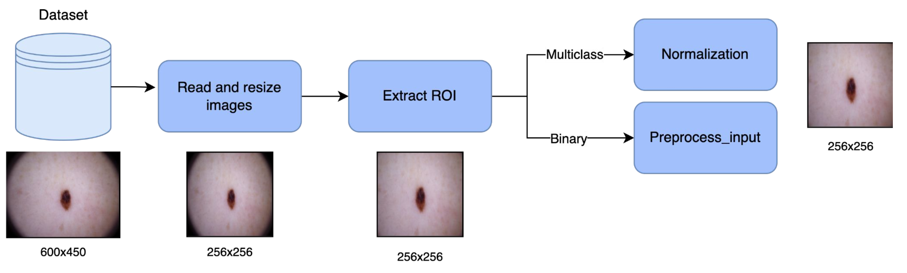

# A Skin Lesion Classification Approach Using Deep Learning
Authors: Muhammad Zain Amin and [Xavier Beltran Urbano](https://xavibeltranurbano.github.io/)

## Setting up the Project

1. Clone the project:
  ```bash
  git https://github.com/xavibeltranurbano/DL_ISIC_2020.git
  cd DL_ISIC_2020
  ```
## Libraries Used

- [copy](https://docs.python.org/3/library/copy.html)
- [time](https://docs.python.org/3/library/time.html)
- [sys](https://docs.python.org/3/library/sys.html)
- [logging](https://docs.python.org/3/library/logging.html)
- [cv2 (OpenCV)](https://opencv.org/)
- [numpy](https://numpy.org/)
- [pandas](https://pandas.pydata.org/)
- [tqdm](https://github.com/tqdm/tqdm)
- [albumentations](https://albumentations.ai/)
- [matplotlib](https://matplotlib.org/)
- [collections](https://docs.python.org/3/library/collections.html)
- [PIL (Pillow)](https://pillow.readthedocs.io/)
- [torch](https://pytorch.org/)
- [torchvision](https://pytorch.org/vision/stable/index.html)
- [tensorflow](https://www.tensorflow.org/)
- [keras](https://keras.io/)
- [scikit-learn](https://scikit-learn.org/stable/)
- [skimage (scikit-image)](https://scikit-image.org/)
- [SummaryWriter (TensorBoard)](https://pytorch.org/docs/stable/tensorboard.html)

## Installation

You can install the required libraries using the following:

```bash
pip install opencv-python numpy pandas tqdm albumentations matplotlib pillow torch torchvision tensorflow keras scikit-learn scikit-image
```

## Dataset

To implement this project, we have utilized the dataset from the ISIC 2020 Challenge. For further information about the dataset, visit the following website: [(link)](https://challenge2020.isic-archive.com/)

## Methodology
In this project, we have divided the different sections as follows:

### · Preprocessing
Due to the fact that transfer learning has been utilized for this project, the preprocessing applied (see Fig. 1) is the following:

1. **Reading and Resizing:** Firstly, the images are read and resized to the corresponding input shape of the pretrained model utilized.

2. **ROI extraction:** Then we have extracted the region of interest in order to remove redundant information of the background.

3. **Normalization or preprocess_input:** As a final step of the preprocessing approach, for the binary task, we have used the preprocessing_input function of the corresponding pretrained model (e.g., EfficientNet). For the multiclass task, we have normalized the image by using the mean and the standard deviation.

<p align="center">

<br>
<em>Fig. 1. Example of the preprocessing employed in this project. </em>
</p>


### · Training
For the binary task, a variety of pretrained models, as detailed in Table 1 and Table 3, were individually tested. Following this, a combined approach was adopted, where the predictions from these individual models were aggregated. This aggregation was achieved through three distinct methods: computing the mean, determining the maximum, and applying majority voting to the predictions of the single models. Further details of this combined approach are presented in Table 2 and Table 4.

## Results
As mentioned in the previous section, both single and combined models have been tested in this project. On one hand, the results of the binary and multiclass tasks with the single model results can be observed in Tables 1 and 2, respectively. On the other hand, the results of the binary and multiclass tasks with the ensemble model results can be observed in Tables 3 and 4, respectively.
<div align="center">

| Model | Accuracy | Kappa |
|-------|----------|-------|
| ResNet50V2 | 0.8895 | 0.7788 |
| EfficientNetV2B2 | 0.8871 | 0.7743 |
| EfficientNetB2 | 0.8940 | 0.7879 |
| EfficientNetB3 | 0.9059 | 0.8119 |
| EfficientNetB4 | 0.9186 | 0.8373 |
| EfficientNetB5 | **0.9261** | **0.8521** |
| EfficientNetB6 | 0.9245 | 0.8489 |
| EfficientNetB7 | 0.8935 | 0.7866 |
| DenseNet201 | 0.9028 | 0.8055 |
| DenseNet169 | 0.8959 | 0.7918 |

</div>
<p align="center">
<em>Table 1: Single model results for the binary task.</em>
</p>

<div align="center">

| Models Name | Accuracy (Mean) | Kappa (Mean) | Accuracy (Max) | Kappa (Max) | Accuracy (Majority Voting) | Kappa (Majority Voting)|
| --------------------------------- |-----------------|------------|----------------|-------------|----------------------------|-------|
| All networks | 0.9270 | 0.8539 | 0.8464 | 0.6942 | 0.8669 | 0.7327|
| All EfficientNet | 0.9296 | 0.8592 | 0.8680 | 0.7370 | 0.8790 | 0.7571|
| Top 5 results (B3,B4,B5, B6, DenseNet201) | 0.9320 | 0.8640 | 0.8883 | 0.7772 | 0.9051 | 0.8090|
| Top 3 results (B4,B5, B6) | 0.9336 | **0.8672** | 0.9120 | 0.8243 | 0.9212 | 0.8421|
| Top 2 results (B5, B6) | **0.9317** | 0.8635 | **0.9233** | **0.8468** | **0.9270** | **0.8538**|

</div>
<p align="center">
<em>Table 2: Ensemble model results for the binary task.</em>
</p>

<div align="center">

| Model | Accuracy | Kappa |
|-----------------|----------|-------|
| ResNet50 | 0.9598 | 0.9278|
| DenseNet161 | 0.9504 | 0.9108|
| EfficientNetB1 | 0.9606 | 0.9293|
| Swin Tiny | 0.9630 | 0.9338|
| Swin Small | 0.9598 | 0.9280|
| Swin V2 S | **0.9724** | **0.9507**|
| Swin V2 B | **0.9724** | 0.9504|

</div>
<p align="center">
<em>Table 3: Single model results for the multiclass task.</em>
</p>
<div align="center">

| Ensemble Models | Accuracy | Kappa |
|-----------------------------------------------------|----------|-------|
| Swin S + Swin V2 S + Swin V2 B | 0.9732 | 0.9520|
| Swin T + Swin S + Swin V2 S + Swin V2 B | 0.9740 | 0.9534|
| ResNet50 + Swin S + Swin V2 S + Swin V2 B | 0.9748 | 0.9547|
| EfficientB1 + Swin S + Swin V2 S + Swin V2 B | **0.9780** | **0.9604**|

</div>
<p align="center">
<em>Table 4: Ensemble model results for the multiclass task.</em>
</p>

## Conclusion and Future Scope

In conclusion, the variety of methods tested led to several findings:

1. Deep Learning outperformed classical approaches in both binary and multiclass challenge.
2. Fine-Tuning the hyperparameters of training models is important and challenging.
3. Leveraging transfer learning proves highly beneficial for enhancing the performance of Deep Learning models, even when confronted with different datasets.
4. Transformers perform very well in Computer Vision and give comparable results to Convolutional Neural Networks.
